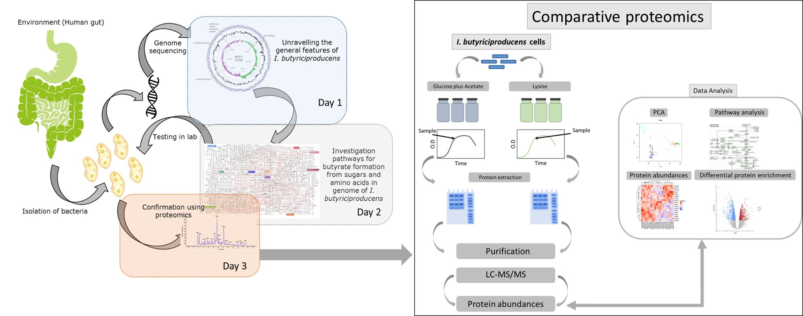

```{r setup, include=FALSE}


if (!requireNamespace("BiocManager", quietly = TRUE))
  install.packages("BiocManager")

#BiocManager::install("DEP")
#BiocManager::install("SummarizedExperiment")
#BiocManager::install("clusterProfiler")
#BiocManager::install("EnrichmentBrowser")
#BiocManager::install("gage")

library(flexdashboard)
library(DEP)
library(SummarizedExperiment)
# install.packages("picante",repos="http://R-Forge.R-project.org") 
# library(picante)
library(clusterProfiler)
library(data.table)
library(DT)
library(RColorBrewer)
library(shiny)
library(shinythemes)
library(pheatmap)
#library(metagenomeSeq)
library(Biobase)
library("EnrichmentBrowser")
library(plotly)
library(gage)
library(tidyr)
library(png)
library(knitr)
library(enrichplot)
options(shiny.maxRequestSize = 30*1024^2) # 25mb limit

av = function(x){
  if( isTRUE(all.equal(x, "")) | isTRUE(all.equal(x, "NULL")) ){
    return(NULL)
  }
  return(x)
}

source("codes/make_data_se_file.R")
source("codes/plot_volcano_custom.R")
```

DATA ANALYSIS  
=======================================================================
Sidebar {.sidebar}
-----------------------------------------------------------------------
```{r upload}

# Proteome table
h3("MIB20306 - PRACTICAL 2019")
hr()
img(src="www/WUR_LOGO.png",height=100,width=200)
h6('image source google images')
hr()
h5("This is an interactive Shiny application to visualize and analyze proteomics data")
hr()

tags$hr()

# Example data
actionButton("load_data", label = 'Load Example Data', width = "225px")

h4('    ')
tags$strong()

h4('Experiment 3 ')
tags$strong()

h5('Genome-guided elucidation of the physiology of the human gut bacterium Intestinimonas butyriciproducens')
tags$strong()

h6('contact: sudarshan.shetty@wur.nl')
tags$strong()

h5('For educational purpose only')  
tags$strong()

```


```{r reactive}

# Reactive values to store imported data
pseq <- reactive({
  
  # Observe for example data
  if(input$load_data > 0){
    showNotification("Using example dataset...", type = "message")
    data_prot <- readRDS("data/data_se_intestinimonas.rds")
    ps0 <- data_prot
    return(ps0)
  } 
  

  # Err if null
  if(is.null(input$upload_ProteomeData) || is.null(input$upload_SampleData)){
    
    return(NULL)

  }
  

  showNotification("Importing data please be patient...", 
                   duration = NULL, type = "message")
   showNotification("Filtering Reverse != "+", Potential.contaminant != "+" please be patient...", 
                   duration = NULL, type = "message")
    
   
   my_data_se <- make_data_sefile(proteomeData = input$upload_ProteomeData$datapath, 
                              SampleData = input$upload_SampleData$datapath)
  
  return(my_data_se)

})


```


Column {data-width=1000} {.tabset .tabset-fade}
-----------------------------------------------------------------------
### Experiment 3  



### Protien Overlap   

Barplot of overlap of protein identifications between samples. Check how many proteins are detected in how many samples. Below we can see that maximum number of proteins are detected in all six samples.  

```{r}

output$LibSizeHist <- renderPlot({
  
  validate(need(expr = !is.null(pseq()), message = "Please upload data..."))
  
  ps0 <- pseq()
  overlap <- plot_frequency(ps0)
  return(overlap)

}, width = 400, height = 400)

fillPage(plotOutput("LibSizeHist"))
```


### Pre-processing and QC  

Quality control (QC) is critical step for any high throughput data driven approach such as proteomics, transcriptomics. Here we can filter the data to keep proteins that are detected in user defined number of replicates. Due to the technical limitation in measurements, there can be proteins detected in only one of the replicate and can have an influence in statistical comparisons between two groups, here, two different growth conditions. 
We can test the influence of these thresholds on the number of proteins that can be used for analysis.

```{r}

fluidPage(
  titlePanel("Filter missing values"),
  
  sidebarLayout(
    
  
sidebarPanel(
  helpText("Sets the threshold for the 
              allowed number of 
              missing values in at least one condition."),
  
  width = 4, column = 3,

 numericInput(
        "Filter_missval_Thres",
        label = "Threshold",0,
       min = 0, 
        max = 10)
),

output$OTUHist_1 <- renderPlot({
  
  validate(need(expr = !is.null(pseq()), message = "Please upload data..."))
  
  ps0 <- pseq()
  data_filt <- filter_missval(ps0, thr = input$Filter_missval_Thres)
  p.num.prot <- plot_numbers(data_filt)
  
  p.num.prot <- p.num.prot + geom_text(aes(label = sprintf("%.1f", sum), y= sum),  
                                     vjust = 3) 
  #p.num.prot <- p.num.prot #+ scale_fill_manual("Carbon Source", values = c("#fbb4ae", "#b3cde3", #ccebc5"))

  #print(p.num.prot)
  return(p.num.prot)
  
  
  }, width = 600, height = 600)


))

``` 

Note: In this step, Filter_missval filters the proteomics dataset based on missing values. The dataset is filtered for proteins that have a maximum of 'thr' missing values in at least one condition. This can help make the analysis stringent.


### Principal Components Analysis    
The PCA plot is a dimension reduction method used to identify over-arching properties of data. It is widely used for identifying similarities and differences betwwen samples e.g. Between replicates. 
```{r}

fluidPage(
  titlePanel("PCA"),
  
  sidebarLayout(
    
  
sidebarPanel(width = 3,  

 numericInput(
        "alpha",
        label = "Threshold for the adjusted P value",0,
       min = 0, 
        max = 10),
 numericInput(
        "Lfc",
        label = "Threshold for the log2 fold change",0,
       min = 0, 
        max = 100),
 numericInput(
        "top_prot",
        label = "Number of top variable proteins to view",100,
       min = 10, 
        max = 100000)
),

output$PCA <- renderPlot({
  
  validate(need(expr = !is.null(pseq()), message = "Please upload data..."))
  
  ps0 <- pseq()
  data_filt <- filter_missval(ps0, thr = input$Filter_missval_Thres)
  data_norm <- normalize_vsn(data_filt)
  set.seed(2156)
  # All possible imputation methods are printed in an error, if an invalid function name is given.
  # Impute missing data using random draws from a Gaussian distribution centered around a minimal value (for MNAR)
  data_imp <- impute(data_norm, fun = "MinProb", q = 0.01)
  
  # Differential enrichment analysis  based on linear models and empherical Bayes statistics
  
  # Test all possible comparisons of samples
  data_diff_all_contrasts <- test_diff(data_imp, type = "all")
  
  dep <- add_rejections(data_diff_all_contrasts, alpha = input$alpha, lfc = input$Lfc)
  
  p.pca <- plot_pca(dep, x = 1, y = 2, n = input$top_prot, point_size = 4,
                    label=F)

  return(p.pca)
  
  
  }, width = 600, height = 800)


))

``` 

 

### Volcano plot      

Volcano plots are routinely used to visualise results of differnet omics experiments. We can visualise  statistical significance (P value) versus magnitude of change (fold change) in protien expression. The one with large fold change may be the most interesting and biologically relavant proteins/genes. Here we label those protein that have atleast 1.0 fold change between conditions. The proteins upregulated in lysine condition are towards the right and downregulated genes are on the left.  

Check for locus tags in this plot with the table in tab called Differential Expression

```{r}

fluidPage(titlePanel("Volcano with differential expression"),
  
  sidebarLayout(
  
sidebarPanel(width = 2,  

 numericInput(
        "FCcutoff",
        label = "Threshold for Fold Change",0.5, 
        min = 0.5, 
       max = 50)),
mainPanel(
            plotOutput('Volcano')
        )))

output$Volcano <- renderPlot({
  
  validate(need(expr = !is.null(pseq()), message = "Please upload data..."))
  
  ps0 <- pseq()
  data_filt <- filter_missval(ps0, thr = input$Filter_missval_Thres)
  data_norm <- normalize_vsn(data_filt)
  set.seed(2156)
  # All possible imputation methods are printed in an error, if an invalid function name is given.
  # Impute missing data using random draws from a Gaussian distribution centered around a minimal value (for MNAR)
  data_imp <- impute(data_norm, fun = "MinProb", q = 0.01)
  
  # Differential enrichment analysis  based on linear models and empherical Bayes statistics
  
  # Test all possible comparisons of samples
  data_diff_all_contrasts <- test_diff(data_imp, type = "all")
  
  dep <- add_rejections(data_diff_all_contrasts, alpha = input$alpha, lfc = input$Lfc)
  
  data_results <- get_results(dep)
  colnames(data_results) <- c("name", "ID", "p.val", "padj", "significant",
                              "Glucose.plus.Acetate_vs_Lysine_significant", 
                              "ratio", "log2FoldChange", "lfc2")
  #p.glu_vs_lysine <- plot_volcano_custom(dep, contrast = "Glucose.plus.Acetate_vs_Lysine", 
  #
  #                                label_size = 2, 
  #                               add_names = TRUE) 
  #return(p.glu_vs_lysine)
  
  
  p.glu_vs_lysine <- EnhancedVolcano::EnhancedVolcano(data_results,
                                                      lab = data_results$name,  
                                                      x = 'log2FoldChange',
                                                      y = 'p.val',
                                                      FCcutoff = input$FCcutoff,
                                                      cutoffLineType = 'twodash',
                                                      cutoffLineWidth = 0.8,
                                                      transcriptPointSize = 1.5,
                                                      transcriptLabSize = 4.0,
                                                      colAlpha = 1,
                                                      legend=c('NS','Log (base 2) fold-change','adj.P value',
                                                               'adj.P value & Log (base 2) fold-change'),
                                                      legendPosition = 'right',
                                                      legendLabSize = 12,
                                                      legendIconSize = 5.0)
  
  return(p.glu_vs_lysine)
  
  }, width = 1100, height = 700)


``` 


### Differential Expression  

Differential enrichment test based on protein-wise linear models and empirical Bayes statistics using [limma](https://academic.oup.com/nar/article/43/7/e47/2414268). Here, we test the the null hypothesis that there is no difference in the protien expression between glucose plus acetate and lysine condition. 

```{r}


output$Table <- renderDataTable({
  validate(need(expr = !is.null(pseq()), message = "Please upload data..."))
  ps0 <- pseq()
    data_filt <- filter_missval(ps0, thr = input$Filter_missval_Thres)
    data_norm <- normalize_vsn(data_filt)
    set.seed(2156)
  # All possible imputation methods are printed in an error, if an invalid function name is given.
  # Impute missing data using random draws from a Gaussian distribution centered around a minimal value (for MNAR)
    data_imp <- impute(data_norm, fun = "MinProb", q = 0.01)
  
  # Differential enrichment analysis  based on linear models and empherical Bayes statistics
  
  # Test all possible comparisons of samples
  data_diff_all_contrasts <- test_diff(data_imp, type = "all")
  
  dep <- add_rejections(data_diff_all_contrasts, alpha = input$alpha, lfc = input$Lfc)
  data_results <- get_results(dep)
  df_wide <- get_df_wide(dep)
  return(data_results)
  
},extensions = c('Buttons'), 
  options = list(  # options
      scrollX = TRUE, # allow user to scroll wide tables horizontally,
      scrollY = "400px",
      stateSave = FALSE,
      dom = 'lfrtips',
      buttons = c('copy', 'csv', 'excel', 'pdf', 'print')
      )
      )

#fillPage(dataTableOutput('Table'))
fillPage(dataTableOutput("Table"))
```

### Heatmap  

```{r}

fluidPage(titlePanel("Heatmap of protiens with variable expression"),
  
  sidebarLayout(
  
sidebarPanel(width = 2,  

 numericInput(
        "TopVar",
        label = "Top Proteins",10, 
        min = 5, 
       max = 1000)),
mainPanel(
            plotOutput('Heatmap')
        )))


  output$Heatmap <- renderPlot({
  
  validate(need(expr = !is.null(pseq()), message = "Please upload data..."))
  
  ps0 <- pseq()
  data_filt <- filter_missval(ps0, thr = input$Filter_missval_Thres)
  data_norm <- normalize_vsn(data_filt)
  set.seed(2156)
  # All possible imputation methods are printed in an error, if an invalid function name is given.
  # Impute missing data using random draws from a Gaussian distribution centered around a minimal value (for MNAR)
  data_imp <- impute(data_norm, fun = "MinProb", q = 0.01)
  
  # Differential enrichment analysis  based on linear models and empherical Bayes statistics
  
  # Test all possible comparisons of samples
  data_diff_all_contrasts <- test_diff(data_imp, type = "all")
  
  dep <- add_rejections(data_diff_all_contrasts, alpha = input$alpha, lfc = input$Lfc)
  
  topVarGenes <- head(order(-rowVars(assay(dep))),input$TopVar)
  mat <- assay(dep)[ topVarGenes, ]
  mat <- mat - rowMeans(mat)
  df <- as.data.frame(colData(dep)[,c("Condition","ID")])
  p.het <- pheatmap(mat, annotation_col=df)


  #p.het <- plot_heatmap(dep, type = "centered", show_row_names = T,
   #          kmeans = F, show_row_dend = F,
    #         indicate = c("condition", "replicate"),
     #        plot = TRUE,
      #       row_font_size = 2)
  #p.glu_vs_lysine <- plot_volcano_custom(dep, contrast = "Glucose.plus.Acetate_vs_Lysine", 
  #
  #                                label_size = 2, 
  #                               add_names = TRUE) 
  #return(p.glu_vs_lysine)
  
  
 
  return(p.het)
  
  }, height = 700, width = 700)


```

### KEGG Pathway IDs-Names  
```{r}

choices =   data <- read.csv("data/kegg_pathway_list.csv", 
                   header = T, 
                   row.names = 1)

output$Table2 <- renderDT({
  
  df <- choices},
  options = list(  # options
      scrollX = TRUE, # allow user to scroll wide tables horizontally,
      scrollY = "400px",
      stateSave = FALSE
))
  
  
fillPage(dataTableOutput('Table2'))
  
```


### KEGG Module Enrichment Analysis  

```{r}

output$plotEnrichNet <- renderPlot({
      validate(need(expr = !is.null(pseq()), message = "Please upload data..."))
  
     ps0 <- pseq()
     data_filt <- filter_missval(ps0, thr = input$Filter_missval_Thres)
     data_norm <- normalize_vsn(data_filt)
    set.seed(2156)
  # All possible imputation methods are printed in an error, if an invalid function name is given.
  # Impute missing data using random draws from a Gaussian distribution centered around a minimal value (for MNAR)
    data_imp <- impute(data_norm, fun = "MinProb", q = 0.01)
  
  # Differential enrichment analysis  based on linear models and empherical Bayes statistics
  
  # Test all possible comparisons of samples
  data_diff_all_contrasts <- test_diff(data_imp, type = "all")
  
  dep <- add_rejections(data_diff_all_contrasts, alpha = input$alpha, lfc = input$Lfc)
  data_results <- get_results(dep)
  df_wide <- get_df_wide(dep)
  
  foldchanges.view = data_results$Lysine_centered
  names(foldchanges.view) = data_results$name
  gene <- names(foldchanges.view)[abs(foldchanges.view) > 1.0]
  
  
    kk <- enrichKEGG(gene         = gene,
                 organism     = 'ibu',
                 pvalueCutoff = 0.05,
                 pAdjustMethod = "none",
                 minGSSize = 5)
    
#    p.net <- cnetplot(kk, categorySize="pvalue", showCategory = 20, foldChange=gene, 
#                      vertex.label.font=6,
#                      circular = F, colorEdge = T)
  
  p.net <- cnetplot(kk, foldChange=foldchanges.view, 
                    showCategory = 20,
                    circular = FALSE)
  
  return(p.net)
  
    })


fillPage(plotOutput("plotEnrichNet"))

```


### KEGG Pathway Anlaysis

```{r}


choices =   data <- read.csv("data/kegg_pathway_list.csv", 
                   header = T, 
                   row.names = 1)
# List of choices for selectInput
mylist <- rownames(choices)
# Name it
#kk <- enrichKEGG(gene         = gene,
#                 organism     = 'ibu',
#                pvalueCutoff = 0.05)

#browseKEGG(kk, 'ibu00650')
fluidPage(
        headerPanel('Pathview'),
        sidebarPanel(
            selectInput('Select', label = h3("Pathway"), choices = mylist, selected = NULL)
        ),
        mainPanel(
            plotOutput('plot1')
        ),

output$plot1 <- renderImage({
          validate(need(expr = !is.null(pseq()), message = "Please upload data..."))  
    ps0 <- pseq()
    data_filt <- filter_missval(ps0, thr = input$Filter_missval_Thres)
    data_norm <- normalize_vsn(data_filt)
    set.seed(2156)
  # All possible imputation methods are printed in an error, if an invalid function name is given.
  # Impute missing data using random draws from a Gaussian distribution centered around a minimal value (for MNAR)
    data_imp <- impute(data_norm, fun = "MinProb", q = 0.01)
  
  # Differential enrichment analysis  based on linear models and empherical Bayes statistics
  
  # Test all possible comparisons of samples
  data_diff_all_contrasts <- test_diff(data_imp, type = "all")
  
  dep <- add_rejections(data_diff_all_contrasts, alpha = input$alpha, lfc = input$Lfc)
  data_results <- get_results(dep)
  df_wide <- get_df_wide(dep)
  
  foldchanges.view = data_results$Lysine_centered
  names(foldchanges.view) = data_results$name
  gene <- names(foldchanges.view)[abs(foldchanges.view) > 1.5]
  kk <- enrichKEGG(gene         = gene,
                 organism     = 'ibu',
                 pvalueCutoff = 0.05,
                 pAdjustMethod = "none",
                 minGSSize = 5)
  browseKEGG(kk, input$Select)
  #pathview::pathview(gene.data = gene, 
   #      pathway.id = input$Select, 
    #     gene.idtype = "REFSEQ",
     #    species = "ibu", 
      #   out.suffix="kegg",
       #           kegg.native=T,
        #          same.layer=T
         #)
  
  
        }, deleteFile = FALSE))
    

```


### Synthetic community  

<h>
Bacteria grow as members of community in natural ecosystems. Investigating physiology of individual bacteria can provide clues as to what are possible growth stratergies employed by specific bacteria in its natural surrounding. However, to test weather the bacteria can really compete for substrates and survive we need to test their growth in presence of other organisms they are likley to share the resources. We can test for this by creating synthetic communities [Shetty S.A., et al. 2019](https://www.sciencedirect.com/science/article/pii/S0958166918302301). These communities consists of specific known species which have been studied individually as mono-cultures to identify thier ability to utilize and produce different substrated and products respectively. 

<h>
<div style="text-align: center"></div>

In this experiment, we grew **five** common human gut bacteria.  
*Faecalibacterium prausnitzii*, gram negative anaerobe that is abundantly present in the healthy human microbiota. It can produce butyrate via butyryl-coA: acetate CoA-transferase when grown on acetate. It has been reported that this species is also able to grow with low concentrations of oxygen in the presence of reduced compounds and riboflavin [Louis, P., & Flint, H. J. 2016](https://doi.org/10.1111/1462-2920.13589).This bacterium may make a significant contribution to D-lactate and butyrate formation in the large intestine [Lopez-Siles, T. K., et al., 2012](https://aem.asm.org/content/78/2/420).  

*Intestinimonas butyriciproducens*, gram-positive and strictly anaerobic bacterium. It synthesizes butyrate by the fermentation of glucose and lysine. It can also use fructoselysine as carbon source to produce butyrate [Bui, T. P. N., et al. 2016](https://doi.org/10.1111/1758-2229.12483).  

*Anaerostipes rhamnosivorans*, gram variable, strictly anaerobic bacterium. It can produce butyrate from glucose as well as from acetate plus lactate.2 Additionally, it has been reported that it can ferment glucose into butyrate, lactate, formate and acetate as main products [Bui, T. P. N., et al. 2014](https://ijs.microbiologyresearch.org/content/journal/ijsem/10.1099/ijs.0.055061-0#tab2).    

*Megasphaera indica* is an obligate anaerobe and a gram-negative bacterium. It can utilize a broad range of carbohydrates as source of carbon and energy [Lanjekar, V. B., et al. 2014](https://ijs.microbiologyresearch.org/content/journal/ijsem/10.1099/ijs.0.059816-0#tab2).  

*Eubacterium hallii* is a gram-positive and strictly anaerobic bacterium which represents 2 to 3 % of the human fecal community. It can produce butyrate as a main product when grown in glucose and lactate. In the absence of glucose, *E. hallii* can completely convert acetate and lactate to butyrate. It has been observed that *E. hallii* is especially abundant in the colonic ecosystem which suggests that these bacteria play an important role in preventing lactate accumulation [Shetty S.A., et al. 2018](https://ijs.microbiologyresearch.org/content/journal/ijsem/10.1099/ijsem.0.003041#tab2).  

 
<h>
<div style="text-align: center"></div>
 
```{r}
#
```


### Co-existence stratergies    

<h>
<div style="text-align: center"></div>

Bacteria are grow as members of community in natural ecosystems. Investigating physiology of individual bacteria can provide clues as to what are possible growth stratergies employed by specific bacteria in its natural surrounding. However, to test weather the bacteria can really compete for substrates and survive we need to test their growth in presence of other organisms they are likley to share the resources. We can test for fitness of bacteria by  


```{r}

output$CoPlot <- renderPlot({
  
  data.mix <- read.csv("data/qpcr_coculture.csv", 
                   header = T, 
                   row.names = 1)
    p.co <- ggpubr::ggline(data.mix, "Timepoint", "CopyNumerPerMilli", 
                           color= "Bacterium", legend="right", palette = "Set2",
                           ylab = "Copy numbers/ml")
    return(p.co)

}, width = 800, height = 400)


fillPage(plotOutput("CoPlot"))

``` 


LEARNING OBJECTIVES
=======================================================================

To integrate genomics, proteomics, and metabolomics to better understand the physiology of a bacterium.  

To learn the necessary bioinformatics tools to better understand microbial physiology.  
To apply -omics data to answer physiological questions.  

**ASSIGNMENT:**  
Work in groups of two students. You should consult the course materials, other bibliography and the web. Answers to this assignment will be used for evaluation.  

Time necessary for the completion of the assignment: 2.66 hrs per day (total 8 hours over three days.)  

Deliver your report in the blackboard (deadline: within eight days i.e. by Friday 17:00 of the week following the practical).  
**DELIVERABLES:**  
- Answers to questionnaire (per group of 2 elements)  
- Poster (if you do this experiment in course weeks 3 or 4)  

R PACKAGES
=======================================================================

```{r}
sessionInfo()
```

